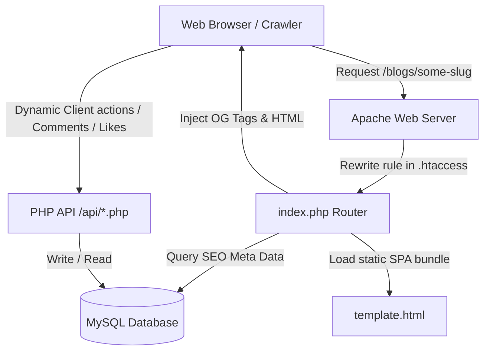

# SuccessWikis - Application Architecture & Deployment Guide

This documentation provides a comprehensive overview of the **SuccessWikis** application architecture, database configuration, local development workflow, and production deployment guidelines.

---

## 1. Overview & High-Level Architecture

SuccessWikis is a premium media platform designed to share startup success stories and entrepreneurial journeys. To achieve **maximum page load speed** and **perfect search engine optimization (SEO)** on standard shared hosting environments, the project utilizes a **hybrid React/Next.js + PHP architecture**:



### Key Architectural Pillars:
1. **Frontend (Next.js SPA):** Built using Next.js (React) as a Single Page Application (SPA). During build time, it is exported as a static HTML/JS/CSS site (`output: 'export'`) in the `out/` folder, allowing it to be hosted on standard shared Apache servers without requiring a Node.js server.
2. **Backend Services (PHP API):** Located inside the `/api` directory. Light-weight PHP scripts handle all dynamic interactions: comment submissions, liking posts, tracking analytics, fetching database posts, and sending emails.
3. **Database Layer (MySQL / SQLite):**
   * **Local Dev:** Connects optionally to SQLite (`api/database.sqlite`) for easy sandbox development.
   * **Production:** Connects to a highly-indexed MySQL database (`u813645463_test` or `u813645463_successwikis`) to scale comments, likes, and custom articles.
4. **Dynamic SEO Engine (`index.php` + `.htaccess`):**
   * Since search engine crawlers (Googlebot, LinkedIn, WhatsApp) do not execute heavy client-side JavaScript, the Apache server routes incoming page queries to `/index.php` via `.htaccess`.
   * `/index.php` queries the MySQL database directly to retrieve the post's title, description, and OpenGraph image, injects these tags into the statically exported Next.js HTML layout (`template.html`), and sends the fully-populated page back instantly. This guarantees **perfect OpenGraph previews on social media** and high Search Console crawl scores.

---

## 2. File & Directory Structure

```
successwikis/
├── api/                        # PHP API Backend
│   ├── .env                    # Connection and SMTP Environment Variables
│   ├── db.php                  # PDO database connection & schema setup
│   ├── comment.php             # GET & POST handler for comments
│   ├── posts.php               # GET handler for dynamic articles
│   ├── like.php                # POST likes handler
│   └── database.sqlite         # SQLite database file (local fallback)
├── public/                     # Static media and logos (Vite/Next public files)
├── src/                        # React Frontend Source Code
│   ├── app/                    # Next.js App Router (blogs, success-wire, events)
│   ├── components/             # Reusable Layout components (BlogLayout, CommentSection)
│   ├── css/                    # Custom stylesheets (blog-post.css, interactive.css)
│   ├── main.jsx                # SPA Client entry point
│   └── App.jsx                 # Client routes
├── .htaccess                   # Apache URL rewrite router config
├── index.php                   # Dynamic SEO Tag Injector router
├── next.config.mjs             # Next.js build compiler settings
├── package.json                # Project node packages and build scripts
└── u813645463_successwikis.sql # MySQL Database schema and static data dump
```

---

## 3. Database Schema

The application schema is automatically initialized or updated via `/api/db.php` upon connection. The database utilizes several indices to optimize reading:

### `posts` Table
Contains all dynamic blog articles, success wire news, events, and pods published via the admin panel.
* **`id`** (INT, Primary Key, Auto-Increment)
* **`post_type`** (VARCHAR - `'blog'`, `'success_lens'`, `'event'`, `'driven_by_purpose'`, etc.)
* **`title`** (VARCHAR)
* **`slug`** (VARCHAR, Unique, Indexed)
* **`meta_description`** (TEXT)
* **`content`** (LONGTEXT / HTML)
* **`image_url`** (VARCHAR - Link to static upload asset)
* **`youtube_link`** (VARCHAR - Embed string)
* **`initial_likes`** (INT)
* **`published_date`** (DATETIME, default CURRENT_TIMESTAMP)
* **`deleted_at`** (DATETIME, NULL if active)

### `comments` Table
Stores user comments on articles, parsed for HTML entities to prevent XSS.
* **`id`** (INT, Primary Key, Auto-Increment)
* **`post_id`** (VARCHAR)
* **`user_name`** (VARCHAR)
* **`content`** (TEXT)
* **`timestamp`** (DATETIME, default CURRENT_TIMESTAMP)

### `likes` Table
* **`id`** (INT, Primary Key)
* **`post_id`** (VARCHAR)
* **`ip_address`** (VARCHAR, Unique composite index with `post_id` to prevent double-likes)
* **`timestamp`** (DATETIME)

### `featured_submissions` Table
* **`id`** (INT, Primary Key)
* **`type`** (VARCHAR - `'founders_unfiltered'`, etc.)
* **`full_name`** / **`email`** / **`company_name`** (VARCHAR)
* **`form_data`** (JSON / TEXT)
* **`status`** (VARCHAR - `'pending'`, `'approved'`)

---

## 4. Local Development

To run the Next.js React frontend and PHP API locally, follow these steps:

### Prerequisites:
1. Node.js (v18 or higher recommended)
2. PHP (v7.4 or higher) installed locally

### Step 1: Install Dependencies
```bash
npm install
```

### Step 2: Configure Local `.env`
Create or edit `/api/.env` and specify SQLite for local zero-config sandbox development:
```ini
DB_CONNECTION=sqlite
SITE_URL=http://localhost:3000/
```

### Step 3: Run the Application
1. **Start the local PHP server (port 8000):**
   ```bash
   php -S 127.0.0.1:8000 -t .
   ```
2. **Start the Next.js frontend (port 3000):**
   ```bash
   npm run dev
   ```
Open [http://localhost:3000](http://localhost:3000) to view and test the application.

---

## 5. Production Deployment (Static HTML Export)

This application is built to run beautifully on standard Apache-based shared hosting platforms (such as Hostinger or cPanel).

### Step 1: Configure Environment Variables
Open [api/.env](file:///Users/webanatomy/Desktop/successwikis/api/.env) and update your database credentials matching your live hosting panel setup:
```ini
DB_CONNECTION=mysql
DB_HOST=localhost
DB_NAME=u813645463_test
DB_USER=u813645463_test
DB_PASS=w;b;a27O
SITE_URL=https://test.successwikis.com/
```

### Step 2: Import the Database Schema
1. Open your hosting control panel and enter **phpMyAdmin** for your database.
2. Go to the **Import** tab.
3. Choose the SQL dump file: **`u813645463_successwikis.sql`**.
4. Keep the default settings and click **Import**. This will populate the schema and existing post/comment history.

### Step 3: Build & Package the Project
To compile the Next.js app to production-ready static assets and package them into a deployment-ready zip file:
1. Run the build command:
   ```bash
   npm run build
   ```
2. Run the automated zip utility:
   ```bash
   node scripts/zip_deploy.js
   ```
This will automatically generate a file called **`deploy.zip`** in your root directory. It contains all the necessary files structured correctly for your Apache host, including:
* Core JS/CSS bundles in `_next/`
* Root static assets in `assets/` and `logo.png`
* Renamed `template.html` (from `index.html` to allow PHP to handle entry point queries)
* The dynamic SEO Tag Injector (`index.php`) and site routes (`.htaccess`)
* Dynamic backend endpoints (`api/` folder) without local SQLite databases

### Step 4: Upload to the Server
1. Clean your server's destination directory (e.g., `public_html` or test subdomain directory).
2. **CRITICAL:** Do NOT upload physical Next.js page folders (like `/admin/`, `/blogs/`, `/events/`, etc.) to the server. The client-side router inside `template.html` + `index.php` handles these routes. Uploading physical directories corresponding to routes causes Apache directory listing conflicts, resulting in `403 Forbidden` errors.
3. Upload **`deploy.zip`** to your host's destination directory and extract it.
4. Set up the correct production database credentials in your server's `api/.env` if it's different from your local workspace config.

---

## 6. Key Integration & Core Components

### Comments & Backslash Prevention:
Comments fetched from the PHP API often undergo database escaping (`addslashes`). In `/src/components/CommentSection.jsx`, the component decodes HTML entities and removes escape slashes:
```javascript
const decodeEntities = (html) => {
    if (!html) return '';
    let cleaned = html
        .replace(/\\'/g, "'")
        .replace(/\\"/g, '"')
        .replace(/\\\\/g, '\\');
        
    if (typeof document !== 'undefined') {
        const txt = document.createElement("textarea");
        txt.innerHTML = cleaned;
        return txt.value;
    }
    return cleaned.replace(/&quot;/g, '"').replace(/&#039;/g, "'");
};
```

### Image Sizing & Layout Compatibility:
All image wrappers define precise bounds (`aspect-ratio: 1`, `height: 250px`, or `width: 60%`) in the CSS, while the absolute Next.js dynamic `<Image>` component occupies 100% width and height of the wrapper using `object-fit: cover` to ensure images never stretch or shift layout.
